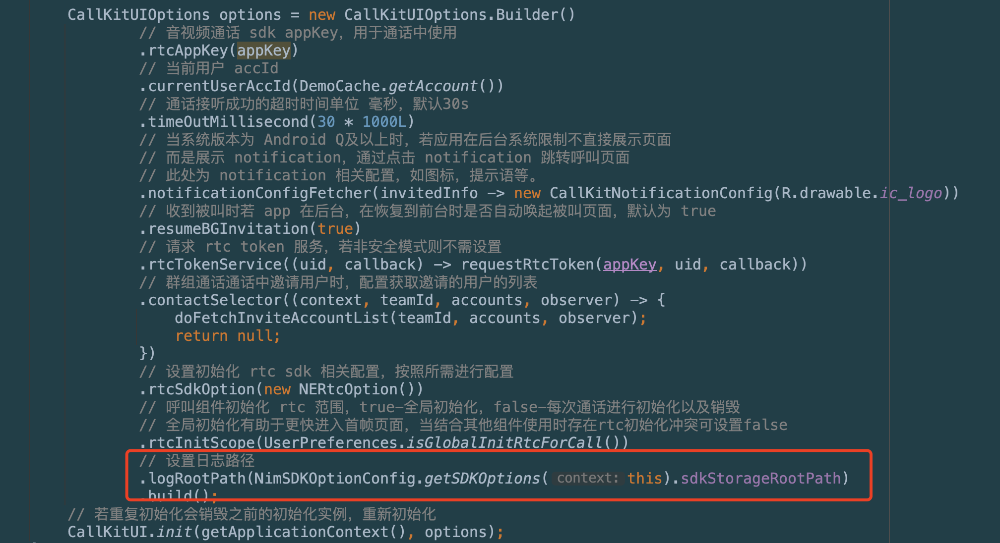
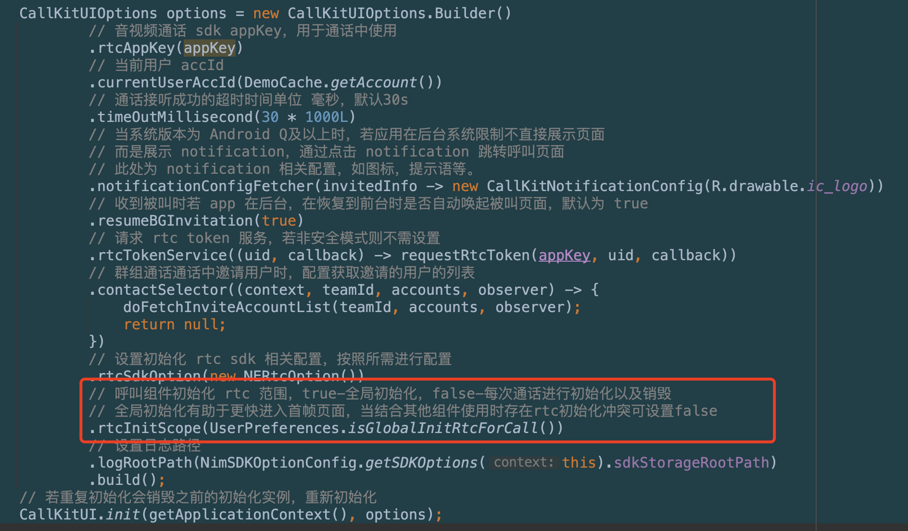

## 常见问题 - Android 

### Q1： 呼叫组件在挂断时候的逻辑，离开 rtc 房间和 close 信令频道是哪个先执行？

A：close信令先执行。

### Q2：如何获取呼叫组件日志？

A：若用户依赖的 IM sdk 版本 为8.5.5+，组件版本为 1.3.3+ 

> 如果用户未修改 IM 的默认日志位置，直接通知 so 提供目标账号的 accId 以及 AppKey 后台拉取即可获得；如果用户修改IM的日志位置，如果想拉取组件可以引导客户设置组件日志和IM 的日志位置相同；
>
> 

若用户使用的组件版本为 1.3.3 以下：组件日志路径：

/sdcard/android/data/应用包名/files/ne_log

### Q3：若用户同时引入呼叫组件以及其他使用 NERtc Sdk 的工程发现不能正常入会？

A：确保组件为1.3.3版本以上，先确定是否其他工程为全局初始化一次 NERtc Sdk 还是每次使用的时候初始化，使用完成后释放。目前组件默认为为全局初始化一次，组件释放时释放 sdk 实例。如果其他工程初始化和组件初始化逻辑不同会产生冲突，导致入会失败。用户可通过设置 `rtcInitScope(false)` 解决。



需要注意的是，若每次通话开始初始化，通话结束释放实例会增加用户接听首帧时长，且呼叫的本地预览无法支持。

### Q4：用户A 多端登录下，用户B 呼叫用户A，用户A多设备均可收到呼叫邀请，但是当其中一端用户点击接听接听时出现无法接听失败的情况？

A：当前设计方案为被叫收到呼叫邀请时，首先加入信令 channel ，但是同一个用户限制只能加入一次信令channel，这就导致多端设备收到呼叫时其中一端加入channel失败，此时加入channel 失败方点击接听会出现问题。若有多端登录的需求可以按照如下配置


### Q5：为什呼叫时展示的昵称不对？

A：呼叫组件展示的昵称均通过云信 IM Sdk 下述方法获取

```java
NIMClient.getService(UserService::class.java).getUserInfo("AccId").getName()；
```

若用户需要展示昵称可以使用下述方法更新目标用户昵称

```java
HashMap<UserInfoFieldEnum, Object> fields = new HashMap<>();
fields.put(UserInfoFieldEnum.Name,"userName");
NIMClient.getService(UserService.class).updateUserInfo(fields);
```

